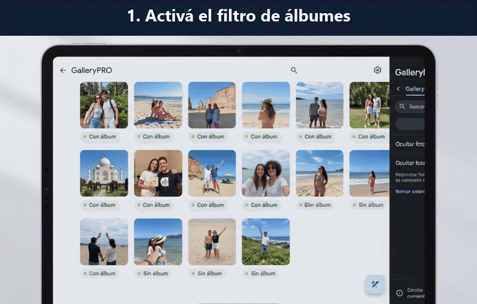

# GalleryPRO


Activá el filtro, encontrá las fotos sin álbum y explorá tu galería. **Pulsá el GIF para ver el video completo.**

[](https://photos.app.goo.gl/bGoM5rxr7TchDGWR9)

Extensión de Chrome para encontrar fotos que no pertenecen a ningún álbum accesible desde tu cuenta. Incluye un filtro reversible dentro de Google Fotos y una galería independiente dentro de la misma pestaña.

## Qué hace

- Analiza los álbumes propios y compartidos que aparecen en la colección de tu cuenta.
- Compara sus elementos con la biblioteca principal, recorriendo todas las páginas.
- Oculta las fotos con pertenencia confirmada a un álbum.
- Muestra las fotos sin álbum en una galería con miniaturas y enlaces al original.
- Permite cancelar y actualizar el análisis, con progreso visible.
- Trabaja en modo de solo lectura: no borra, mueve ni modifica contenido.

## Instalación

Requisitos de desarrollo: Node.js 22 o posterior y Git. No hay paquetes que instalar.

```sh
git clone https://github.com/GermanBartoli/gallerypro.git
cd gallerypro
npm test
npm run build
```

1. Abrí `chrome://extensions` y activá **Modo de desarrollador**.
2. Elegí **Cargar descomprimida** y seleccioná la carpeta `dist` del proyecto.
3. Abrí o recargá [Google Fotos](https://photos.google.com/).
4. En el panel **GalleryPRO**, pulsá **Analizar biblioteca**.
5. Activá **Ocultar fotos con álbum** o abrí la galería cuando termine el análisis.

En Windows, `npm run package` genera `releases/gallerypro-0.1.0.zip`. Para instalar desde el ZIP, descomprimilo y seleccioná esa carpeta mediante **Cargar descomprimida**. No se utiliza un instalador de Windows.

## Cómo se interpretan los resultados

| Estado | Significado |
| --- | --- |
| Con álbum | Coincidencia comprobada por identificador de foto o clave compartida entre biblioteca y álbum |
| Pendiente | Aún no se completaron todas las lecturas; no equivale a una foto sin álbum |
| Sin álbum | El análisis terminó y no encontró la foto en los álbumes accesibles analizados |

La galería no muestra resultados definitivos durante un análisis parcial, cancelado o fallido. Si un álbum no puede leerse, el análisis queda incompleto.

## Límites de esta versión

- **Integración experimental:** utiliza consultas de lectura no documentadas de la web de Google Fotos. Google puede cambiarlas sin aviso. La [API oficial](https://developers.google.com/photos/support/updates) no permite analizar una biblioteca existente completa.
- El alcance es la biblioteca principal. No analiza archivo, papelera ni carpeta privada. La galería muestra fotos; los videos no se ocultan.
- Se incluyen los álbumes compartidos presentes en tu colección. Un enlace compartido no incorporado a ella, o contenido sin acceso, no puede considerarse analizado.
- La cuadrícula de Google Fotos es virtual: para conservar su desplazamiento, el filtro mantiene el espacio de las miniaturas ocultas. La galería ofrece una vista compacta sin esos espacios.
- Los resultados son una fotografía del momento del análisis. Después de modificar álbumes, usá **Actualizar análisis**.
- Los cambios de cuenta descartan el índice y cancelan el trabajo pendiente. Recargar o cerrar la pestaña también borra los resultados.
- Las bibliotecas grandes pueden tardar varios minutos. Las solicitudes son secuenciales y no se reintentan de forma ilimitada.
- No está publicada en Chrome Web Store ni es un producto oficial de Google.

## Privacidad

Los identificadores y miniaturas se procesan en la pestaña, en memoria. Solo se guarda la preferencia de ocultar fotos. No hay servidor propio, telemetría ni claves configuradas por el usuario. Las solicitudes y las miniaturas se obtienen directamente de Google con la sesión existente. Ver [privacidad](docs/privacidad.md).

## Estructura

```text
src/core/          Clasificación y análisis paginado
src/integration/   Adaptador de lectura para Google Fotos
src/content/       Panel, filtro reversible y preferencias
src/gallery/       Galería paginada en un diálogo
assets/            Iconos
tests/             Pruebas con datos ficticios
scripts/           Compilación y ZIP
docs/              Arquitectura, privacidad y verificación
.github/workflows/ Validación automática
```

## Desarrollo

`npm test` ejecuta las pruebas de Node; `npm run build` valida la sintaxis y genera la extensión; `npm run package` crea el ZIP en Windows. GitHub Actions valida pruebas y compilación, y guarda un artefacto instalable.

Ver [arquitectura](docs/arquitectura.md), [verificación](docs/verificacion.md) y [cómo contribuir](CONTRIBUTING.md).

## Licencia y créditos

Licencia MIT. El adaptador utiliza información del protocolo contrastada con [Google Photos Toolkit](https://github.com/xob0t/Google-Photos-Toolkit). Se conservan sus avisos MIT en [THIRD_PARTY_NOTICES.md](THIRD_PARTY_NOTICES.md).
